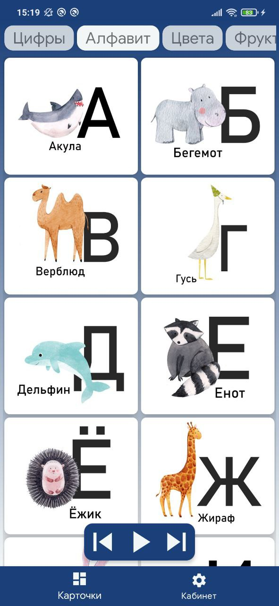
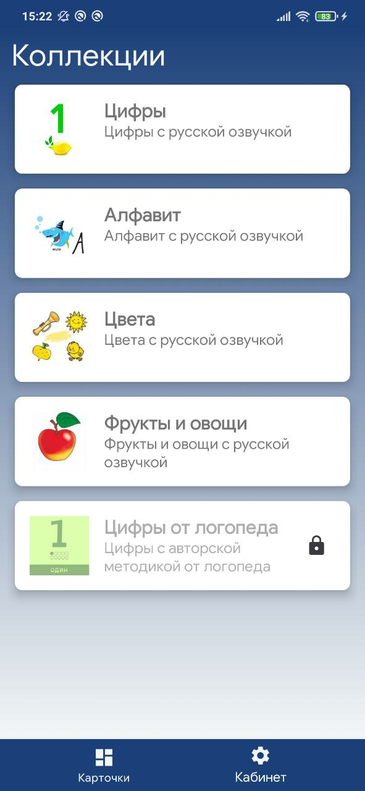
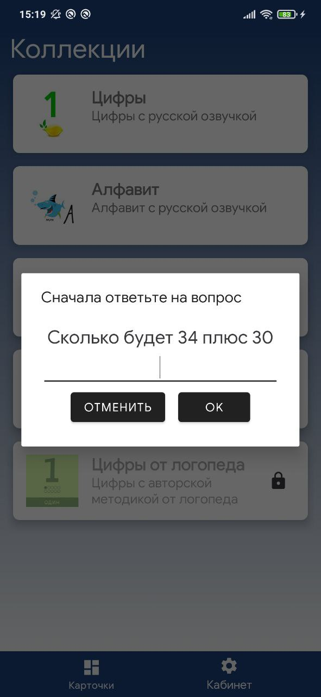
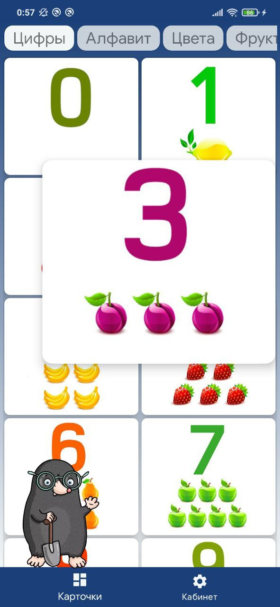

### Kids Smart Card

Kids Smart Cards with sound accompaniment, background music and animated characters

App based on:

- MVVM (Jetpack ViewModel + Kotlin SharedFlow)
- Repository based on Coroutines Flow and suspend functions
- Koin as DI
- Room and OkHttp in data module
- Splash screen with logo
- Exoplayer for working with audio

Show screenshoots:

<table>
  <tr>
    <td></td>
    <td></td>
    <td></td>
    <td></td>
  </tr>
</table>

